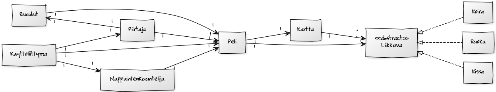
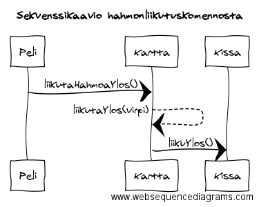
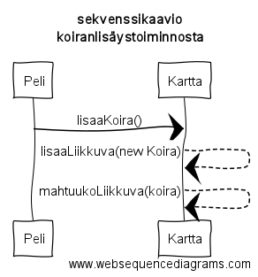

**Aihe:** Kissapeli, jossa Virpi -niminen kissa hankkii ruokaa ja ohittaa esteet. Perinteinen sivulle scrollaava peli, jossa pelaajan hahmo liikkuu kaistalta toiselle ja yrittää kerätä erilaisia asioita ja väistellä esteitä.

**Käyttäjät:** Pelaaja

**Käyttäjien toiminnot:**

- pelin käynnistäminen
- pelaaminen

**Rakennekuvaus:** Liikkuva -oliot, eli Kissa, Koira ja Ruoka ovat pelissä liikkuvia objekteja, Kissan toimiessa pelihahmona. Kaikki toteuttavat abstraktin Liikkuva -luokan. 

Kartta -olio sisältää listan, jossa objektit sijaitsevat. Se sisältää myös objektien liikutuskomennot, sekä pelitilanteen päivityksen näitä komentoja hyödyntäen.

Käyttöliittymän käynnistyksessä luodaan Peli -olio joka luo käynnistettäessä itselleen Kartan sekä Kissan pelihahmoksi. Peli -olio pitää myös kirjaa pelin tilasta, mm. pisteistä ja elämien määrästä sekä kartta-olion avulla objektien sijainneista. Se myös lisää aika ajoin peliin uusia objekteja.

Piirtäjä hakee objektien sijainnit Peliltä ja piirtelee kuvia niiden mukaisesti. Ruudut -luokassa on piirtokomennot alku-, ohje- ja loppuruuduille.

**Sekvenssikaaviot:**

**Käyttöohjeet:** Kun käynnistät pelin, aukeaa aloitusruutu, josta pääsee peliin painamalla enter, tai lukemaan peliohjeet painamalla space. Pelihahmona toimii musta kissa, jota liikutellaan joko WASD- tai nuolinäppäimillä. 
Ruudulle ilmaantuu hiiriä ja koiria - hiiristä saa pisteitä ja koirista menettää elämiä. Aina kun 500 pistettä tulee täyteen, peli vaikeutuu hieman siten, että koiria ilmestyy enemmän.
Jos saat 5000 pistettä kasaan ennen elämien loppumista, pääset pelin läpi.