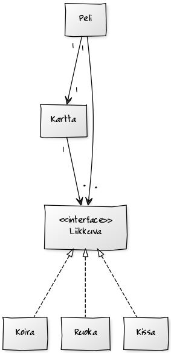

**Aihe:** Kissapeli, jossa Virpi -niminen kissa hankkii ruokaa ja ohittaa esteet. Perinteinen sivulle scrollaava peli, jossa pelaajan hahmo liikkuu kaistalta toiselle ja yrittää kerätä erilaisia asioita js väistellä esteitä.
Pelaaja voi valita erilaisista hahmoista, joilla on erilaisia ominaisuuksia liittyen kerättyjen asioiden vaikutuksiin. Pelissä on erilaisia kenttiä, joiden välillä pelitilanteen voi tallentaa.

**Käyttäjät:** Pelaaja

**Käyttäjien toiminnot:"

- pelin käynnistäminen
- pelaaminen
- pelin tallennus

