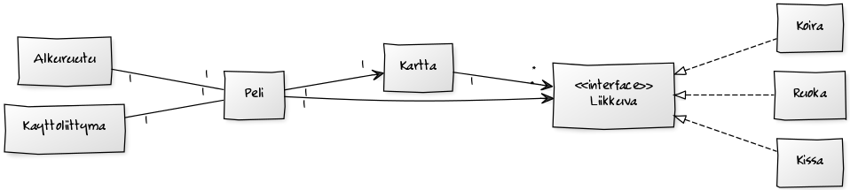

**Aihe:** Kissapeli, jossa Virpi -niminen kissa hankkii ruokaa ja ohittaa esteet. Perinteinen sivulle scrollaava peli, jossa pelaajan hahmo liikkuu kaistalta toiselle ja yrittää kerätä erilaisia asioita ja väistellä esteitä.

**Käyttäjät:** Pelaaja

**Käyttäjien toiminnot:**

- pelin käynnistäminen
- pelaaminen

**Rakennekuvaus:** Liikkuva -oliot, eli Kissa, Koira ja Ruoka ovat pelissä liikkuvia objekteja, Kissan toimiessa pelihahmona. Kartta -olio sisältää "ruudukon" jossa objektit sijaitsevat. Se sisältää myös pelin olennaisen toimintalogiikan, eli hahmon liikutuskomennot, sekä pelitilanteen päivityksen.

Käyttöliittymän käynnistyksessä luodaan Peli -olio joka luo itselleen Kartan, Kissan sekä erinäisiä Ruokia ja Koiria ja sijoitaa nämä Karttaan. Peli päivittää ruudulle piirrettävää kuvaa, sekä sijoittaa aika ajoin karttaan uusia objekteja ja käyttää Kartan metodeja liikutteluun.

Ruudut -luokassa on piirtokomennot alku-, ohje- ja loppuruuduille.

**Käyttöohjeet:** Kun käynnistät pelin, aloitusruudussa <SPACE> -näppäimellä pääset peliohjeisiin.